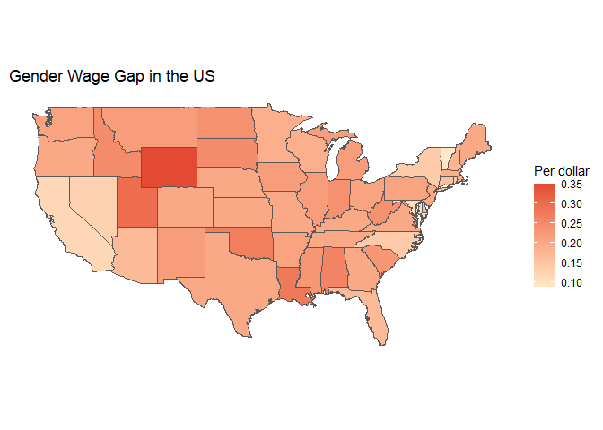

Intro
================

## About me

I'm an undergraduate at Smith College studying Statistical and Data Sciences. I am proficient in R/RStudio, Python, and Java. 
I enjoy dancing, food co-op living, and pictures of snails and frogs.

## Examples of my work

This text-based adventure game is an Alice in Wonderland themed final project for Data Structures, Spring 2022 
https://replit.com/@LillianFok/CSinWonderland#Main.java 

This visualization was created for Intro to Statistical and Data Sciences, Fall 2021

<!-- -->

